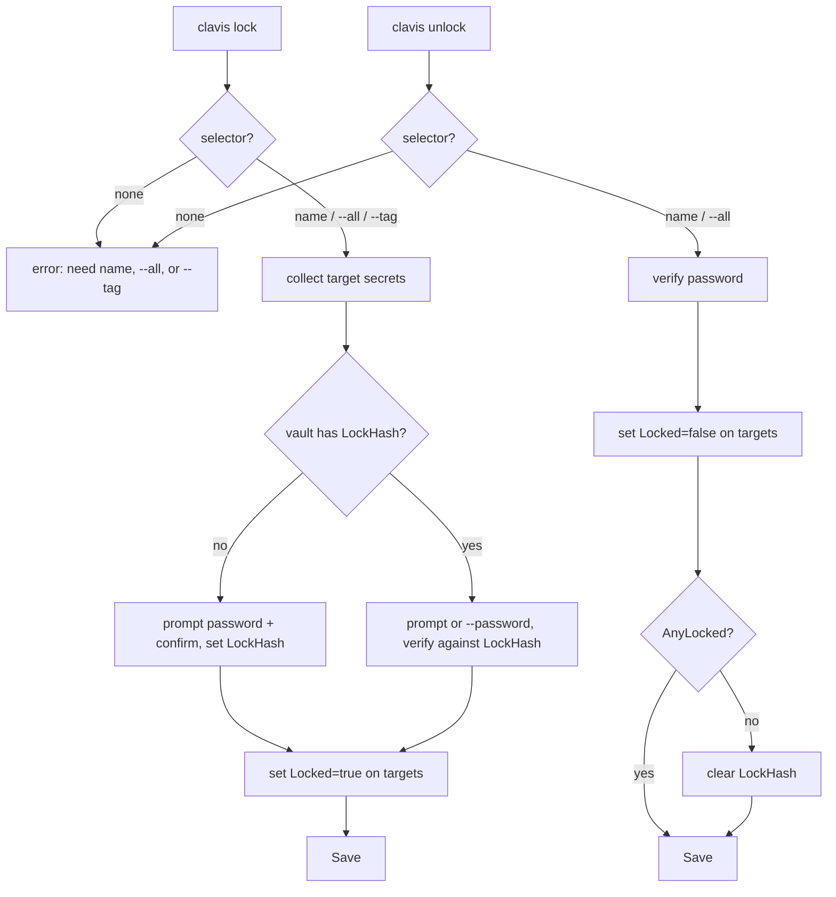
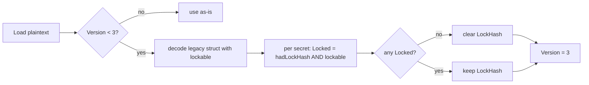

# feat: Per-secret locking

## Summary

Make clavis lock state **per-secret** instead of all-or-nothing. Today you mark
secrets `lockable`, then one `clavis lock` freezes every lockable secret at once
behind a shared password. This plan replaces that with a per-secret `Locked` flag so
individual credentials lock and unlock independently — letting you hand a vault to an
autonomous agent while holding a few creds back. The lock stays **soft/advisory** (a
bcrypt password gate the CLI honors, not new cryptography) and keeps **one shared
password** set on the first lock.

---

## Problem Frame

Clavis is agent-first: you hand a vault to an autonomous agent so it fetches only the
creds it needs. The v1.0.0 lock is coarse — `clavis lock` freezes *all* lockable
secrets together, and `clavis unlock` releases *all* of them. You cannot keep the prod
database password out of reach while leaving the rest usable.

The origin spec (see origin) settled three decisions that bound this plan:

- **Threat model:** soft/advisory. The lock is a bcrypt check the CLI honors; secret
  values remain age-encrypted only. Real per-secret cryptography is out of scope.
- **Password model:** one shared password, set on first lock, verified thereafter. The
  same password opens any locked secret.
- **Command surface:** collapse the two concepts (`lockable` flag + global lock state)
  into a single per-secret `Locked` state. Retire `clavis lockable`.

---

## Requirements

- **R1** — A secret carries its own locked state; locking one does not affect others.
- **R2** — `clavis lock <name>` locks one secret; `clavis unlock <name>` unlocks one.
- **R3** — First lock in a vault with no password prompts to set one (password +
  confirm); later locks verify against the stored bcrypt hash.
- **R4** — `clavis lock --all` and `clavis lock --tag <k:v>` bulk-lock; `clavis unlock
  --all` bulk-unlocks. `--all`, `--tag`, and a positional `<name>` are mutually
  exclusive; a bare `lock`/`unlock` with no selector errors with a hint.
- **R5** — `get`/`show` refuse a locked secret with `secret %q is locked`.
- **R6** — `list` shows 🔒 next to locked secrets, no icon otherwise.
- **R7** — Unlocking the last locked secret clears the shared password (`LockHash`).
- **R8** — Pre-v3 vaults migrate cleanly: `Locked = (had LockHash) AND (old Lockable)`;
  a vault with a `LockHash` but no lockable secrets has its `LockHash` cleared. No data
  loss, no manual step.
- **R9** — `clavis lockable` and the `Lockable` field are removed.
- **R10** — Agent-facing docs, README, and shell completion reflect the new surface.

---

## Key Technical Decisions

- **KTD1 — `Locked bool` on `Secret`, `Lockable` removed.** One source of truth for
  "is this secret locked right now." (see origin: Data model)
- **KTD2 — Keep vault-level `LockHash` as the single shared password.** Set on first
  lock; cleared when no secrets remain locked. `IsLocked()` keeps its meaning ("a lock
  password is set") and is used only to decide prompt-to-set vs verify.
- **KTD3 — Migration lives in `vault.Load`.** After the normal unmarshal, if
  `Version < 3`, decode the plaintext a second time into a legacy-aware struct that
  still has `lockable`, apply the R8 rule, set `Version = 3`. Save rewrites v3 on the
  next mutation. A second decode is the least-invasive way to recover a field that no
  longer exists on the live struct. **Load does not write to disk** (it never has); the
  migrated state persists on the next `Save`, and every write command calls `Save`.
- **KTD4 — Vault gains `LockSecret`/`UnlockSecret`/`AnyLocked`; the old whole-vault
  `Lock`/`Unlock` methods are replaced.** Password prompting/confirmation stays in the
  command layer (as today), so the vault methods take an already-collected password.
- **KTD5 — `lock`/`unlock` become one command each with optional positional + flags**,
  rather than new `lock-secret`/`unlock-secret` verbs. Matches the spec's "replace, one
  concept" decision and keeps the CLI small.

---

## High-Level Technical Design

Lock/unlock control flow (command → vault):

Migration on load (pre-v3 → v3):

---

## Implementation Units

### U1. Data model: add `Locked`, remove `Lockable`

**Goal:** Make per-secret locked state the single source of truth on the `Secret` type.
**Requirements:** R1, R9
**Dependencies:** none
**Files:**
- `internal/secret/secret.go` (modify)
- `internal/secret/secret_test.go` (modify)

**Approach:** Replace the `Lockable bool` field with `Locked bool`
(`json:"locked,omitempty"`). No accessor methods are strictly required (callers set
`s.Locked` directly, matching how `s.Lockable` was used), but keep the struct field
ordering/comment style consistent with the existing file.

**Patterns to follow:** Existing field tags and the `omitempty` convention already on
`Lockable`.

**Test scenarios:**
- A new secret has `Locked == false`.
- Setting `Locked = true` and marshaling/unmarshaling round-trips the field.
- `Test expectation:` this unit is largely structural; the behavioral coverage lives in
  U2–U4. Include the round-trip test to lock the JSON key name (`locked`).

---

### U2. Vault: per-secret lock/unlock methods + migration

**Goal:** Give the vault the operations the commands need, and migrate pre-v3 vaults.
**Requirements:** R1, R2, R3, R7, R8
**Dependencies:** U1
**Files:**
- `internal/vault/vault.go` (modify)
- `internal/vault/vault_test.go` (modify)

**Approach:**
- Remove `Lock(password)` / `Unlock(password)`. Add:
  - `LockSecret(name, password string) error` — find secret (error if not found or
    already locked); if `!IsLocked()`, set `LockHash` from `password` (bcrypt); else
    verify `password` against `LockHash` (error on mismatch); set `s.Locked = true`.
  - `UnlockSecret(name, password string) error` — find secret (error if not found or
    not locked); require `IsLocked()`; verify `password`; set `s.Locked = false`; if
    `!AnyLocked()`, clear `LockHash`.
  - `AnyLocked() bool` — true if any secret has `Locked`.
- Keep `IsLocked()` as `LockHash != ""`.
- **Migration in `Load`:** after `json.Unmarshal` into `Vault`, if `v.Version <
  config.VaultVersion`, run `migrateToV3(plaintext, &v)`:
  - Decode `plaintext` into a local legacy struct mirroring the schema but with a
    per-secret `Lockable bool` (`json:"lockable"`).
  - For each secret, set `Locked = (v.LockHash != "") && legacy.Lockable`.
  - If no secret ends up `Locked`, clear `v.LockHash`.
  - Set `v.Version = config.VaultVersion`.
  - Match secrets by `Name` (names are unique — `Add` enforces replace-by-name).

**Patterns to follow:** Existing bcrypt use in `Lock`/`Unlock`; `Get` for name lookup;
`json.Unmarshal` in `Load`.

**Test scenarios:**
- `LockSecret` on a fresh vault sets `LockHash` and marks only the named secret
  `Locked`; a sibling secret stays `Locked == false` and readable.
- Second `LockSecret` with the **same** password locks another secret; with a
  **different** password returns an error and does not change state.
- `LockSecret` on an already-locked secret errors; on an unknown name errors.
- `UnlockSecret` with the correct password unlocks only the named secret; wrong password
  errors and leaves state unchanged; unknown name / not-locked errors.
- Unlocking the **last** locked secret clears `LockHash` (`IsLocked()` becomes false);
  unlocking one of several leaves `LockHash` set.
- `AnyLocked` reflects current state.
- **Migration:** a v2 vault with `LockHash` set and two `lockable` secrets loads as v3
  with exactly those two `Locked` and `Version == 3`. Construct the fixture by
  marshaling a legacy JSON blob (version 2, `lock_hash`, `lockable:true`) and
  encrypting via `Save`-equivalent, or by unit-testing `migrateToV3` on raw bytes
  directly (preferred — avoids crypto in the migration test).
- **Migration:** a v2 vault with no `LockHash` loads with nothing `Locked`.
- **Migration:** a v2 vault with `LockHash` set but zero `lockable` secrets loads with
  `LockHash` cleared and `IsLocked() == false`.

**Verification:** `go test ./internal/vault/...` passes, including the rewritten
lock tests and new migration tests.

---

### U3. `config.VaultVersion` → 3

**Goal:** Mark the schema-semantics change so migration triggers.
**Requirements:** R8
**Dependencies:** none (but U2 consumes it)
**Files:**
- `internal/config/config.go` (modify)

**Approach:** Bump `VaultVersion` from 2 to 3. `New()` already stamps
`config.VaultVersion`, so fresh vaults become v3 automatically.

**Test scenarios:** `Test expectation: none` for this unit directly — covered by U2's
migration tests and the updated `TestVaultCreateAndLoad` (which must assert `Version ==
3`).

---

### U4. Commands: rewrite `lock`/`unlock`, remove `lockable`

**Goal:** Deliver the new CLI surface.
**Requirements:** R2, R3, R4, R9
**Dependencies:** U2
**Files:**
- `cmd/clavis/lock.go` (rewrite)
- `cmd/clavis/unlock.go` (rewrite)
- `cmd/clavis/lockable.go` (delete)

**Approach:**
- `lock`: `Use: "lock [name]"`, `Args: cobra.MaximumNArgs(1)`. Flags: `--all bool`,
  `--tag string`, `--password string`. Resolve the target set:
  - exactly one selector must be present (positional name XOR `--all` XOR `--tag`); zero
    selectors → error `"specify a secret name, --all, or --tag"`; more than one → error.
  - `--tag` parses via `internal/tags.Parse` and selects via `v.List(map[...])`.
  - `--all` selects `v.Secrets`.
- Password handling mirrors today's `lock.go`: if `--password` set, use it; else if the
  vault has no `LockHash` yet, prompt for password + confirm; else prompt once. Then call
  `v.LockSecret(name, password)` for each target. If the vault has no password yet, the
  **first** target sets it and subsequent targets in the same run verify against it
  (which trivially succeeds since it's the same in-memory hash) — collect the password
  once, before the loop.
- Skip targets already locked (no-op with a note) rather than aborting a bulk run.
- `unlock`: `Use: "unlock [name]"`, `Args: cobra.MaximumNArgs(1)`. Flags: `--all bool`,
  `--password string`. Selector rules: positional XOR `--all`; zero → error. Prompt once
  for the password (or `--password`), then `v.UnlockSecret` each target. Error if the
  vault is not locked at all.
- Delete `lockable.go` and its `rootCmd.AddCommand(lockableCmd)`.
- Print a summary: `Locked N secret(s).` / `Unlocked N secret(s).`

**Patterns to follow:** Existing `lock.go`/`unlock.go` password prompting with
`golang.org/x/term`; `list.go` tag parsing and `v.List`; cobra flag registration in
`init()`.

**Test scenarios (integration-level, exercised in U6; unit-level where practical):**
- `lock <name>` with no existing password prompts+sets and locks only that secret.
- `lock` with no selector errors.
- `lock --all` locks every secret with one password entry.
- `lock --tag env:prod` locks only tagged secrets.
- `lock --name` + `--all` together errors (mutually exclusive).
- `unlock <name>` with correct password unlocks one; wrong password errors.
- `unlock --all` releases everything and clears the password.

---

### U5. Enforcement + display: `get`, `show`, `list`

**Goal:** Point read paths and listing at the new `Locked` field.
**Requirements:** R5, R6
**Dependencies:** U1
**Files:**
- `cmd/clavis/get.go` (modify)
- `cmd/clavis/show.go` (modify)
- `cmd/clavis/list.go` (modify)

**Approach:**
- `get.go` / `show.go`: replace `if v.IsLocked() && s.Lockable` with `if s.Locked`,
  keeping the error `fmt.Errorf("secret %q is locked", name)`.
- `list.go`: replace the `s.Lockable` + `isLocked` branch with `if s.Locked { indicator =
  " \U0001F512" }` and drop the 🔓 (`\U0001F513`) branch and the now-unused
  `isLocked := v.IsLocked()`. Indicator applies in all three output modes (plain,
  `--tags`, `--verbose`) exactly as today.

**Patterns to follow:** Existing lock-check placement in `get.go:88` / `show.go:49`; the
`lockIndicator` composition in `list.go`.

**Test scenarios:**
- Locked secret: `get`/`show` return the "is locked" error; unlocked sibling returns its
  value. (Exercised in U6 integration; add a focused unit test if the command layer is
  unit-testable without a real vault — otherwise rely on U6.)
- `list` renders 🔒 for a locked secret and no icon for an unlocked one, in plain and
  `--verbose` modes.

---

### U6. Integration test + docs + completion

**Goal:** Prove the end-to-end flow and update all user- and agent-facing surfaces.
**Requirements:** R4, R5, R6, R10
**Dependencies:** U4, U5
**Files:**
- `scripts/integration-test.sh` (modify)
- `docs/AGENT_INSTRUCTIONS.md` (modify)
- `README.md` (modify)
- `clavis-completion.bash` (modify)

**Approach:**
- **Integration test:** add a locking section — add secrets A and B, `lock A`, assert
  `get A` fails and `get B` succeeds, `unlock A`, assert both succeed; then
  `lock --tag <k:v>` on a tagged secret and assert a non-tagged secret stays readable;
  `unlock --all`. Use `--password` for non-interactive runs.
- **AGENT_INSTRUCTIONS.md:** remove the `clavis lockable` line; rewrite the
  "Lock protection" section to describe `clavis lock <name>` / `unlock <name>` and the
  `--all` / `--tag` bulk forms; keep "if a secret is locked, stop and ask a human to
  unlock it."
- **README.md:** update the lock section to the per-secret commands.
- **clavis-completion.bash:** drop `lockable`; keep `lock`/`unlock`; add `--all` /
  `--tag` / `--password` flag completions consistent with existing entries.

**Patterns to follow:** Existing structure of `scripts/integration-test.sh` and the
current lock wording in `docs/AGENT_INSTRUCTIONS.md` and `README.md`.

**Test scenarios:**
- `scripts/integration-test.sh` passes end-to-end with the new locking section.
- `Test expectation: none` for the doc/completion edits (non-behavioral) beyond the
  integration script exercising the commands they document.

**Verification:** `go build ./...`, `go test ./...`, and
`bash scripts/integration-test.sh` all pass.

---

## Scope Boundaries

**In scope:** per-secret `Locked` state, one shared password, `lock`/`unlock` command
rewrite with `--all`/`--tag`, migration to v3, enforcement in `get`/`show`/`list`, and
doc/completion updates.

### Deferred to Follow-Up Work

- None identified.

### Out of scope (from origin spec)

- Real cryptographic per-secret encryption (locked values unreadable without password).
- Per-secret passwords.
- Session tokens / time-based auto-unlock.
- Per-tier passwords (unlock a whole tag with a tier-specific password).

---

## System-Wide Impact

- **Breaking change:** bare `clavis lock` / `clavis unlock` (no selector) now error
  instead of acting globally; `clavis lockable` is gone. Acceptable per the origin
  decision — v1.0.0 was just released and this is the author's call.
- **On-disk format:** `VaultVersion` 2 → 3. Old vaults migrate on first load; migrated
  state persists on the next write. Forward-only (no downgrade path), consistent with the
  existing single-version model.
- **Agent behavior:** agents following `docs/AGENT_INSTRUCTIONS.md` must use the new
  commands; the doc update in U6 covers this.

---

## Risks & Dependencies

- **R-risk1 — Migration data recovery.** The old `lockable` field is gone from the live
  struct, so migration must decode the plaintext twice. Mitigation: unit-test
  `migrateToV3` directly on raw bytes (KTD3, U2) so the rule is verified without crypto.
- **R-risk2 — Existing tests reference the old API.** `TestVaultLockUnlock`,
  `TestVaultLockAlreadyLocked`, `TestVaultUnlockWhenNotLocked`, `TestVaultLockPersistence`,
  and `TestVaultCreateAndLoad` (asserts `Version == 2`) all break. U2/U3 rewrite them as
  part of the change — this is expected, not incidental breakage.
- **R-risk3 — Bulk password entry.** Collect the password once per run before the loop
  so `lock --all` prompts a single time (U4).

---

## Sources & Research

- Origin spec: `docs/superpowers/specs/2026-07-07-per-secret-locking-design.md` (approved).
- Existing implementation read during planning: `cmd/clavis/{lock,unlock,lockable,get,show,list}.go`,
  `internal/vault/vault.go`, `internal/secret/secret.go`, `internal/config/config.go`,
  `internal/vault/vault_test.go`.
